# Verity (Multi agent verification MCP to minimise hallucinations)

LLMs confidently claim things that are manifestly untrue. Enforce has developed Verity, a tool that helps minimise false claims and fake sources from self-hosted LLMs. It can run on cheap, old hardware. We think it is the first MCP that combines cross-family LLM critics, NLI, deterministic arithmetic recompute, consistency sampling, perplexity, and identifies disputes among these many critics. Today, we are releasing Verity for anyone to use, test, adapt, and improve.

Verity can also produce second opinions. If you have a spare old graphics card Verity can use it to produce second opinions at the same time that your primary LLMs responds. Both answers are then considered by your primary LLM. Once adapted for your hardware, you can easily use Verity in LM Studio. We are also sharing our system prompts, which help minimise LLM mistakes even without Verity.

[](https://docs.claude.com/en/docs/claude-code/mcp)
[](https://modelcontextprotocol.io/quickstart/user)
[](https://docs.cursor.com/context/model-context-protocol)
[](https://docs.windsurf.com/windsurf/cascade/mcp)
[](https://github.com/cline/cline)
[](https://github.com/openai/codex)
[](https://zed.dev/docs/assistant/mcp)
[](https://modelcontextprotocol.io)


<picture>
  
</picture>

---

## Quick start for local LLM (one-click install)

Verity itself needs only Node.js 18+. Everything else is a choice of where the models run. The one-click install below uses the reference design because it is the least setup, not because it is required: your primary in LM Studio, the critics in Ollama. But any OpenAI-compatible backend can serve in either role, and Verity can run without LM Studio at all. See "Adapt for your hardware" for vLLM, TGI, llama.cpp, cloud providers, and other MCP clients.

The reference one-click install uses:

1. Node.js 18 or newer, the only hard requirement.
2. Git, used by the installer to clone the repo. Without it, download the files and run `npm install` then `npm run build` yourself.
3. LM Studio 0.3.x or newer, as the MCP client and primary LLM host. Claude Desktop or another MCP client also works, or you can skip the client and use the confidence proxy.
4. Ollama for the two critics (the Vulkan build on AMD).

Then run the installer for your platform.

### Windows

Right-click `install-verity.ps1` and choose "Run with PowerShell".

The script clones the repo to `%USERPROFILE%\Verity`, installs the Node dependencies, builds the server, and pulls the two critic models. Allow about ten minutes the first time.

### Apple Silicon Mac

Double-click `install-verity-mac.command`. First time, right-click, Open, confirm the security prompt.

Same effect as the Windows installer, into `~/Verity`. The installer also sets `CONSULT_DUAL=0`; unified memory means one GPU, so the dual-GPU second-opinion path has nothing to do.

### After the installer finishes

Open LM Studio. Settings, Model Context Protocol. Paste:

```json
{
  "mcpServers": {
    "verity": {
      "url": "http://localhost:8090/mcp",
      "timeout": 240000,
      "retries": 1
    }
  }
}
```

Load a chat model in LM Studio. 

Then go to **Start** below.

---

## Current line-up

Four roles. Each runs as a separate model. Swap any of them.

| Role     | Current model                     | Where it runs               |
|----------|-----------------------------------|-----------------------------|
| LLM      | Qwen 3.5 9B (Q4_K_M)              | Strong GPU, via LM Studio   |
| Critic A | IBM Granite 4.1 8B (Q4_K_M)       | Weak GPU, via Ollama        |
| Critic B | Ministral 3B, Mistral AI (Q4_K_M) | Weak GPU, via Ollama        |
| NLI      | DeBERTa-v3-large (ONNX)           | CPU                         |

The names will change. Treat them as placeholders. From here on the document refers to your primary LLM as the "worker", Critic A, Critic B, and the NLI check, not to any specific model. Note the spread, though: the worker is from Alibaba, the two critics from IBM and Mistral. Three makers, three sets of blind spots, which is the point rather than the particular models.

---

## Start

### Windows

Run `start-verity.ps1`. It pins Ollama to the weak GPU, brings up the Verity server on port 8090, and reports status. Close the window when done; both services keep running.

To unload: `start-verity.ps1 -Action Stop`.

### Mac

From a Terminal prompt:

```
cd ~/Verity/project
node dist/index.js
```

Stop with Ctrl-C. A double-click launcher is on the deferred list.

### Using it

Ask the worker anything. Append `/verify` to the question. Verity returns a table of critic verdicts and a verdict.

The first chat after restarting LM Studio sometimes fails to call Verity. MCP plugins register a few seconds after LM Studio's UI is ready. Wait five seconds before the first message, or send a one-word "hi" first.

---

## Adapt for your hardware

Verity assumes a strong GPU for the worker and a weak GPU for the critics. The architecture survives other shapes; you just edit a few values in `project/src/config.ts`. Every user-tunable value is marked `[ADAPT]`.

### Two NVIDIA cards

Default. Worker on the strong card via LM Studio, both critics on the older card via Ollama. No special environment variables.

### NVIDIA strong, AMD weak (the reference build)

Ollama needs its Vulkan build. The launcher pins Ollama to the AMD card via `VK_DRIVER_FILES`. Without this, Ollama lands on the NVIDIA card, the worker spills to system RAM, and every call times out.

### One GPU only

Drop the split. Put the worker and both critics under the same backend. Use smaller critics so all three models fit. Set `CONSULT_DUAL=0` to disable the dual-card second-opinion path.

### Apple Silicon

One unified memory pool. The installer sets `CONSULT_DUAL=0` for you. The NLI check runs on CPU and is fine.

### Asymmetric: one strong card, one tiny card

Drop to a one-critic panel. Edit `ALL_CRITICS` in `project/src/critics/critic-configs.ts` to a single entry. Set `MAX_UNAVAILABLE_CRITICS = 0`. You lose cross-critic disputes; the rest still works.

### Cloud model as the worker

A standard `/verify` never calls the worker; it reads only the question and the answer text. So with any cloud model you can paste the answer, append `/verify`, and the local critics do the rest, with no setup.

Deep and deeper modes do call the worker, for re-sampling, claim extraction, and regeneration. Point those at the cloud with three settings:

```
WORKER_ENDPOINT=<base URL>
WORKER_API_KEY=<your key>
WORKER_MODEL=<model id>
```

| Provider | `WORKER_ENDPOINT` | Connects directly | Perplexity (logprobs) |
|----------|-------------------|-------------------|-----------------------|
| OpenAI                  | `https://api.openai.com/v1`                                 | Yes | Yes |
| Microsoft Azure OpenAI  | `https://<resource>.openai.azure.com/openai/v1/`            | Yes | Yes |
| Google Gemini           | `https://generativelanguage.googleapis.com/v1beta/openai/`  | Yes | No on this surface |
| Anthropic (Claude)      | `https://api.anthropic.com/v1/`                             | Yes | No |
| Mistral (La Plateforme) | `https://api.mistral.ai/v1`                                 | Yes | No |

Critics, NLI, recompute, and consistency work with all of these; consistency just re-samples, which any of them can do. Perplexity needs token logprobs, so it works on OpenAI and Azure OpenAI and is skipped with a note on the rest: Anthropic ignores the request and returns nothing, Gemini exposes logprobs only on its native API rather than the OpenAI surface above, and Mistral has no logprob parameter. For Azure, `WORKER_MODEL` is your deployment name, not the catalogue id. If a provider's auth does not fit a plain `Authorization: Bearer` header, or it has no OpenAI-compatible surface, put a gateway such as LiteLLM in front and point `WORKER_ENDPOINT` at that.

Two things to weigh. Cost: deeper re-samples the worker five times, so one check is five cloud generations. Privacy: a standard check keeps the answer on the machine, but deep and deeper send the question and the answer to the provider. Keep the worker local if either matters.

### Where logprobs come from

Two signals use token logprobs: the perplexity check, and the proxy below. Whether they are available depends on the model server, not on Verity. For local backends:

| Backend | Logprobs | What Verity gets |
|---------|----------|------------------|
| LM Studio                | Responses API only (`/v1/responses`)                  | Scores a re-answer; proxy works |
| llama.cpp `llama-server` | `logprobs` on chat, `n_probs` on `/completion`        | Scores the answer, roughly |
| vLLM                     | `logprobs` plus `prompt_logprobs` / `echo`            | Scores the exact answer under review |
| Hugging Face TGI         | `decoder_input_details`                               | Scores the exact answer under review |
| Ollama                   | native `/api/generate` only; the OpenAI path drops them | No proxy; perplexity only via the native API |
| Jan                      | not surfaced                                          | Nothing |

The split that matters: vLLM and TGI can score the answer a user already has; LM Studio can only score text it generates itself, so its perplexity is a re-answer, exact on a deterministic question and a near-twin otherwise. Point Verity at vLLM or TGI if you want the answer under review scored directly.

### Confidence on every answer (the proxy)

In a sealed chat window (the LM Studio app, `ollama run`) Verity cannot see an answer's tokens, so it can only score confidence when you run a deep verify. Chat through an external client and the proxy removes that limit.

Point Open Web UI, Jan, LibreChat, or AnythingLLM at the proxy (`http://localhost:1235/v1`) instead of at the backend, and start it with `npm run proxy`. A plain answer then arrives with a confidence note whenever the model was unsure; tool calls, structured output, images, and everything else pass through untouched. The per-request rules and client setup are in `docs/confidence-proxy.md`.

The proxy needs a backend that serves logprobs from a responses-style endpoint: LM Studio does, Ollama does not (see the table above).

### Settings that almost always need tuning

| setting                              | What to tune                                       |
|-----------------------------------|----------------------------------------------------|
| `WORKER_MODEL_NAME`               | Match whatever you run in LM Studio                |
| `CRITIC_A_MODEL`, `CRITIC_B_MODEL`| Whatever fits the weak GPU                         |
| `CRITIC_TIMEOUT_MS`               | 45 s default; lower on faster hardware             |
| `PIPELINE_TIMEOUT_MS`             | Roughly three times the slowest critic             |
| `WARN_SEVERITY_THRESHOLD`         | Tighten if critics are quiet                       |
| `FAIL_SEVERITY_THRESHOLD`         | Loosen if critics are noisy                        |

Critic prompts in `project/src/prompts.ts` are the second-biggest lever after model choice.

### What stays the same

MCP wiring, aggregator rules, dispute detection, the recompute pass, the NLI check, consistency and perplexity. Pure logic; no GPU dependency.

---

## Commands

Type any of these after a worker reply.

### Depth

| Command         | What runs                                                   | Time   |
|-----------------|-------------------------------------------------------------|--------|
| `/verify`       | Two critics, NLI claim check, recompute                     | 3-5 s  |
| `/verifydeep`   | Standard, plus 2-sample consistency, advisory uncertainty   | ~20 s  |
| `/verifydeeper` | Standard, plus 5-sample consistency, advisory uncertainty   | ~40 s  |

### Context

| Command                | What it does                                          |
|------------------------|-------------------------------------------------------|
| `/verify`              | Minimal context. Question and answer only.           |
| `/verify with context` | Worker passes the relevant prior messages.           |
| `/verify full`         | Worker passes the whole visible conversation.        |

### Modifiers

| Command                | Effect                                                |
|------------------------|-------------------------------------------------------|
| `/verify no-nli`       | Skip the NLI claim check.                            |
| `/verify as code`      | Force task_type=code.                                |
| `/verify as prose`     | Force task_type=prose.                               |
| `/verify as reasoning` | Force task_type=reasoning.                           |

Modifiers stack. `/verifydeeper as code no-nli with context` is valid.

### Second opinion

| Command           | Effect                                                                  |
|-------------------|-------------------------------------------------------------------------|
| `/second`         | Two cross-family models answer the same question. A third pass compares them. |
| `/verify /second` | Both run. `/second` first, then `/verify`.                              |

---

## How a verdict is built

Five checks, fired in parallel.

1. **Critic A and Critic B.** Two smaller LLMs read the worker's answer and return structured JSON: verdict, severity, concerns, suggested fixes.
2. **NLI claim check.** Each factual claim is paired with the prior context. A 0.4 B encoder transformer (not an LLM) labels each pair as entailment, contradiction, or neutral. Runs on CPU.
3. **Recompute pass.** Pure code. Pulls arithmetic and unit conversions out of the answer, evaluates them, flags mismatches. 100% precision when it fires.
4. **Consistency** (deep modes only). Re-asks the worker N times at temperature 0.7. Compares each re-sample against the original.
5. **Perplexity** (deep modes only, advisory). Reads the worker's own token probabilities and flags low-confidence spans as model uncertainty. A nudge, not a vote: it never moves the verdict on its own, and it cannot catch a confident, fluent error. The consistency check guards against that.

Each check has a different failure profile. That is the point. Two LLMs from similar training data tend to be wrong about the same things; when they agree, they often agree wrong. The NLI classifier was trained on entailment labels, not helpfulness preferences. The recompute pass has no bias profile at all because it is not statistical. When two layers built on different machinery agree on a flaw, the signal is strong.

The aggregator combines the first four into one of: pass, warn, fail, error. Perplexity rides alongside as an advisory note and never changes the verdict.

A separate disputes table is computed after the verdict. It surfaces concerns one critic raised but not the other. The user sees disagreement even when the headline verdict is pass.

---

## Reference machine and current setup

The reference build is a 2021 PC. NVIDIA RTX 5070 Ti (16 GB, 2025) for the worker. AMD Radeon RX 5700 XT (8 GB, 2019) for the critics. CPU runs the NLI classifier.

VRAM use, current line-up:

| Role     | Size  | VRAM    | Device                          |
|----------|-------|---------|---------------------------------|
| Worker   | 9 B   | ~5.5 GB | Strong GPU, LM Studio           |
| Critic A | 8 B   | ~5.3 GB | Weak GPU, Ollama                |
| Critic B | 3 B   | ~2.5 GB | Weak GPU, Ollama                |
| NLI      | 0.4 B | ~1 GB   | CPU (ONNX Runtime)              |

The strong GPU uses about a third of its memory. The two critics now fill most of the weak card, roughly 8 GB of models on an 8 GB card, so KV-cache headroom is slim. Drop Critic A to a q3 quant if Ollama starts evicting.

Verity wants two things from the critics: different training data than the worker, and small enough to share the weak GPU. Family diversity matters more than size. Two small critics from different vendors catch more than one large critic that shares the worker's training family.

---

## Known caveats

- **First chat after restarting LM Studio.** MCP plugins register two to six seconds after LM Studio's UI is ready. A first chat sent in that gap will not see Verity. Wait, or send a warm-up message first.
- **Convergent failure.** If the worker and both critics share the same training mistake, they agree confidently and are wrong together. Family diversity helps; it does not eliminate this.
- **No prior context.** With nothing to check claims against, the NLI check has no premise and produces no signal. Pairwise intra-answer NLI was tested and is off by default.
- **Recent facts.** Everything is local and offline. Claims past the worker's training cutoff cannot be checked against a live source unless the worker also calls the fetch tool.
- **Consistency catches uncertainty, not confident error.** Re-sampling the same model just yields N samples from the same distribution.
- **Aesthetic complaints.** Filtered out.

---

## Project layout

```
verity/
├── install-verity.ps1            (Windows installer)
├── install-verity-mac.command    (Apple Silicon installer)
├── start-verity.ps1              (Windows launcher; pins Ollama, starts server)
├── CLI/
│   └── ollama-amd.ps1            (AMD-pinning helper for Ollama)
└── project/
    ├── src/
    │   ├── config.ts             (every [ADAPT] setting lives here)
    │   ├── index.ts              (MCP entry point)
    │   ├── aggregator.ts         (verdict logic)
    │   ├── critics/              (critic configs, prompts)
    │   ├── nli/                  (DeBERTa wrapper)
    │   ├── signals/              (recompute, consistency, perplexity, confidence)
    │   ├── second-opinion/       (the /second tool)
    │   └── proxy/                (optional confidence proxy for external clients)
    ├── package.json
    └── README.md                 (original v1 README; this file is v2)
```
